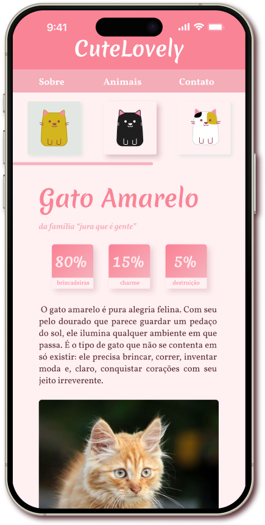

# 🐾 Cutelovely

  

Projeto baseado no **Wildbeast da Origamid**, recriado para praticar **CSS Grid** com abordagem **mobile first** e uma estética **fofa e responsiva**.

---

## ✨ Objetivo

- Praticar **CSS Grid** em um projeto real.
- Aplicar conceitos de **design responsivo** (mobile first).
- Criar uma identidade visual acolhedora com cores suaves e ícones autorais.

---

## 🎨 Design

- Paleta criada no [Coolors.co](https://coolors.co/), explorando **tons de rosa suaves** para transmitir delicadeza.
- Ícones de gatos desenhados no **Figma**, com cinco variações de cor.
- Estilo visual inspirado em **sites de mascotes/animais**, mas adaptado para algo mais **fofo e pessoal**.

---

## 🖼️ Screenshots

### Paleta de cores

<a href="https://coolors.co/palette/e3e7e4-fff0f2-f4acb7-f98496-954955"> Paleta Coolors adaptada </a>
\_

### Ícones de gatos

  
  
  
  
  

### Layout

Versão mobile

  
  
  

Versão desktop

  
  

---

## 📌 Futuro / Roadmap

Planejo expandir o **Cutelovely** com novas funcionalidades e páginas, mantendo o foco na responsividade:

- 📱 **Sidenav responsiva** para cada gato (permitindo navegação entre perfis).
- 📖 **Menu responsivo completo**, incluindo:
  - Página **Sobre**
  - Página **Contato**
- 🎯 **Previsão de conclusão:** Outubro/2025.

---

## 🔗 Links

- [🔗 Ver site online](https://pazedev.github.io/CuteLovely/)
- [🎨 Case no Behance](https://www.behance.net/gallery/233673851/CuteLovely)
