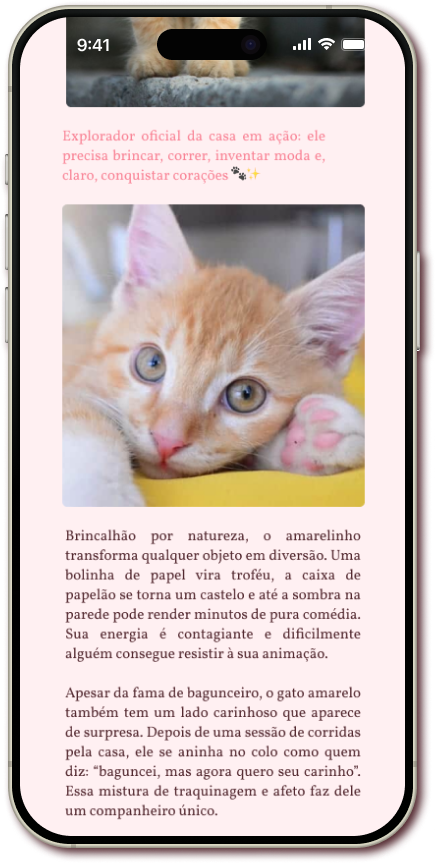

# 🐾 Cutelovely

  

Project based on **Origamid's Wildbeast**, recreated to practice **CSS Grid** with a **mobile-first** approach and a **cute and responsive** aesthetic.

---

## ✨ Goal

- Practice **CSS Grid** in a real project.
- Apply **responsive design** concepts (mobile-first).
- Create a warm visual identity with soft colors and custom icons.

---

## 🎨 Design

- Palette created on [Coolors.co](https://coolors.co/), exploring **soft pink tones** to convey delicacy.
- Cat icons drawn in **Figma**, with five color variations.
- Visual style inspired by **pet/animal websites**, but adapted to something **cute and personal**.

---

## 🖼️ Screenshots

### Color Palette

<a href="https://coolors.co/palette/e3e7e4-fff0f2-f4acb7-f98496-954955"> Adapted Coolors Palette </a>
\_

### Cat Icons

  
  
  
  
  

### Layout

Mobile Version

  
  
  

Desktop Version

  
  

---

## 📌 Future / Roadmap

I plan to expand **Cutelovely** with new features and pages, keeping a focus on responsiveness:

- 📱 **Responsive sidenav** for each cat (allowing profile navigation).
- 📖 **Full responsive menu**, including:
  - **About** page
  - **Contact** page
- 🎯 **Estimated completion:** October/2025.

## 🔗 Links

- [🔗 Ver site online](https://pazedev.github.io/CuteLovely/)
- [🎨 Case no Behance](https://behance.net/seu-case)
